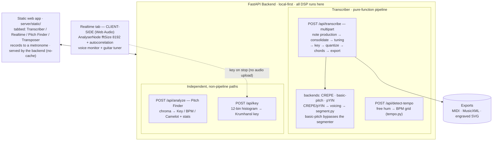

<h1 align="center">🎙️ HumJob</h1>

<p align="center">
  <strong>Hum "da-da-da" to a metronome → get the notes, the key, and suggested chords</strong><br>
as MIDI, MusicXML, and engraved sheet music. A local-first Python pipeline<br>
wrapped in a FastAPI web app that also does <strong>live in-browser pitch<br>
monitoring</strong>, a <strong>guitar tuner</strong>, and whole-track <strong>Key / BPM / Camelot</strong><br>
analysis — every byte processed on your own machine, no cloud, no upload.
</p>

<p align="center">
  
  
  
  
  
  
  
  
</p>

<p align="center">
  
  
  
  
  
  
</p>

<p align="center">
  
</p>

---

## Key Features

- **A chain of pure functions over three data types**
  - The whole Transcriber is a pipeline over `Frame` (one per ~12 ms hop), `NoteEvent` (a discrete note) and `Score` (the transcription): `audio → preprocess → note production → consolidate → tuning → key → quantize → chords → export`
  - **Every tunable knob lives in one place** (`config.py`, `Params`) — behaviour changes there, not as magic numbers scattered through the stages

- **Two load-bearing tricks make it tractable** (the reason it works where phone apps fail)
  - You hum **"da-da-da"** — the consonant gives every note a crisp onset and separates repeated same-pitch notes
  - You hum **to a metronome at a known BPM** — a known tempo grid turns rhythm from *estimation* into *snapping*

- **Three interchangeable note-detection backends** (A/B them on your own voice)
  - **CREPE** (`crepe`) — a CNN pitch tracker **trained for the singing voice** (torchcrepe, CPU). Steadiest pitch on a bare hum, no octave jumps. **The web app default.**
  - **basic-pitch** (`basic_pitch`) — Spotify's pretrained CNN, run on **ONNX Runtime**. Great on simple instrument clips, but *instrument*-trained so it can octave-jump on voice. The CLI default.
  - **pYIN** (`pyin`) — classic DSP f0 tracker + our own segmenter. Crisp on staccato "da-da-da". The library default (`Params()`).

- **Backend-agnostic consolidation** — the fix for the "one held note → many slivers" bug
  - Every detector over-segments a sustained, vibrato'd note in its own way; a single pass (`consolidate.py`) fuses the fragments back into one note, for **all three backends**

- **Realtime tab — live pitch monitor + guitar tuner** (entirely client-side)
  - **Voice monitor** — sing or hum and see the **note name, frequency (Hz), and a ±50-cent needle**, with a scrolling pitch graph. Hit Stop and it reads out the **key** of what you sang
  - **Singing practice tools** (all client-side): set a **target note** by clicking the graph (with an in-tune band and a short **reference tone**), and watch live **steadiness + sustain**, a **vibrato** readout (rate and depth), and a per-take **in-tune %**. Two guided drills - a **Match game** (sing back random notes) and a **Scale trainer** (follow a scale or arpeggio to a click) - plus a **vocal range finder** and a **Progress** panel that saves each take's stats locally (no upload) with an in-tune-% sparkline
  - **Guitar tuner** — walk the six strings **thickest→thinnest** (standard EADGBE); the needle shows cents flat/sharp against the target string and **auto-advances** once it holds in tune. An 8192-sample analysis window resolves even the low-E string to ~±3 cents
  - Runs on Web Audio (`AnalyserNode` + autocorrelation) — a server round-trip could never be realtime. The only network call is a tiny key lookup on Stop (a pitch-class histogram, **no audio upload**)

- **Pitch Finder tab — any track → Key / BPM / Camelot + stats**
  - Drop in an mp3 / wav / flac / m4a — full songs or single instruments — and get **Key, BPM, and Camelot code**, with a hover-documented **Advanced statistics** panel (key/tempo confidence, tuning & reference A4, spectral centroid/rolloff/bandwidth, zero-crossing rate, loudness/peak/dynamic range, onset density, pitch-class distribution, compatible mixing keys)
  - A **separate chroma-based path** (not the monophonic humming segmenter), so it works on polyphonic audio

- **Musical post-processing, done right**
  - **Tuning** — a single global offset, so humming 40 cents flat still lands on the right semitones
  - **Key** — Krumhansl–Schmuckler correlation over a duration-weighted pitch-class histogram (one scorer shared by the Transcriber, Pitch Finder, and Realtime key readout)
  - **Quantize** — snaps onsets/durations to the known-BPM grid, estimating a global grid *phase* so a lead-in doesn't misalign everything; each note takes its own length (with the short "da" articulation gap folded back in), so identical hums get identical durations and only genuine gaps become rests
  - **Chords** — one diatonic triad per measure, scored by melody coverage (strong beats and long notes weighted heaviest), then smoothed with a Viterbi progression prior (moves like V→I are cheap)

- **This is a segmentation problem, not a model problem**
  - When notes come out wrong the pitch *contour* is usually fine — the fix lives in `segment.py` / `consolidate.py` / `quantize.py`, not in a bigger model. Finetuning was considered and rejected (wrong tool, and there is no labelled hum dataset)

- **Local-first, light, and hot-reloading**
  - Static multi-page web app (HTML / CSS / JS, no framework, no build step), served by the backend at a single origin, dark-mode aware
  - A no-cache middleware serves the UI fresh from disk, so JS/HTML/CSS edits need only a browser refresh; Python edits reload automatically via watchfiles
  - Records with **raw-mic constraints** (browser speech-DSP off) so a soft hum isn't gated to silence
  - **Validated:** transcribes every synthetic fixture at note-F1 ≥ 0.95, and a real 150-note melody at **note-F1 0.987** with the key correct

- **Transposer tab** — a disabled "coming soon" placeholder, scaffolded to lock in the tab structure

---

## Architecture



---

## Tech Stack

| Layer | Tech |
|---|---|
| Backend | Python 3.12, FastAPI, Uvicorn (`--reload` via watchfiles), python-multipart |
| Frontend | Static HTML / CSS / JS (`server/static/`) — no framework, no build step, served by the backend behind a no-cache middleware |
| Pitch — CREPE | **torchcrepe** — a CNN pitch tracker trained for the singing voice, on CPU-only PyTorch. The web app default; installed `--no-deps` to protect the pinned numpy |
| Pitch — basic-pitch | Spotify's **basic-pitch** CNN, run on **ONNX Runtime** (its TensorFlow pin has no Python 3.12 wheel) |
| Pitch — pYIN | librosa's pYIN f0 tracker + our own `segment.py` |
| Realtime pitch | **Client-side Web Audio** — `AnalyserNode` (fftSize 8192) + autocorrelation; no server round-trip |
| DSP / audio I/O | librosa (pYIN, onset, resample), SciPy, soundfile (WAV I/O), **ffmpeg** (decode any upload) |
| Key detection | Krumhansl–Schmuckler correlation over a pitch-class histogram (`key.py`) — shared by the Transcriber, Pitch Finder, and Realtime key readout |
| Notation / export | pretty_midi (MIDI), music21 (MusicXML), **verovio** (engrave MusicXML → sheet-music SVG, no external tools) |
| Numerics | **numpy pinned to 2.0.2** — the neural backends are installed isolated so nothing bumps it |
| Evaluation | mir_eval (note-F1, pitch accuracy), matplotlib (debug plots) |
| Live capture | Browser `MediaRecorder` with **raw-mic constraints** (speech DSP off); `sounddevice` for optional native capture |

---

## How to use

### 1. Set up the environment

Requires **Python 3.12** and **ffmpeg** on your PATH.

```bash
python -m venv .venv
.venv\Scripts\python -m pip install -r requirements.txt   # Windows
# or: source .venv/bin/activate && pip install -r requirements.txt
```

The two neural backends are installed **separately and isolated from the pinned numpy 2.0.2 stack** (see [`requirements.txt`](requirements.txt) for the full reasoning). To enable them:

```bash
# basic-pitch — runs on ONNX Runtime, not TensorFlow (no TF 3.12 wheel exists):
.venv\Scripts\python -m pip install basic-pitch --no-deps
.venv\Scripts\python -m pip install "resampy<0.4.3" --no-deps
.venv\Scripts\python -m pip install onnxruntime

# CREPE (the web app's default) — CPU-only PyTorch (~120 MB) + torchcrepe:
.venv\Scripts\python -m pip install torch torchaudio --index-url https://download.pytorch.org/whl/cpu
.venv\Scripts\python -m pip install torchcrepe --no-deps
.venv\Scripts\python -m pip install tqdm
```

### 2. Choose a launcher

**Option A — one click (recommended)**

Double-click **[`run.bat`](run.bat)** (or `./run.ps1` in PowerShell). It starts Uvicorn on **http://localhost:8000** with `--reload` and opens your browser. Source edits hot-reload: JS/HTML/CSS need only a browser refresh, Python reloads automatically.

**Option B — manual**

```bash
python -m uvicorn server.app:app --port 8000 --reload
```

### 3. Use the app

Open **http://localhost:8000**. The app is tabbed:

- **🎙️ Transcriber** — set the tempo (slider, **Tap tempo**, or **🎙 Find my tempo** — hum a few beats and it detects your BPM), hit Record, wait for the count-in, and hum "da-da-da" to the click. Get back the **key, suggested chords, engraved sheet music, and MIDI / MusicXML downloads**, plus in-browser piano playback. 🎧 Use headphones so the click doesn't bleed into the mic. The result has an **Auto / Manual** toggle: **Manual** is an in-browser staff editor for fixing the draft — click or arrow to a note, then change its pitch, length, split/merge/delete/insert, with undo/redo and a reference strip of your hummed pitch vs the chosen notes. "Update chords + key" re-scores the edits, and it exports edited MIDI / MusicXML. Everything runs locally (engraving via a vendored verovio-WASM build).
- **🎤 Realtime** — live pitch monitoring (note name + Hz + a ±50¢ needle + a scrolling graph; Stop reports the sung **key**) and a **guitar tuner** (six strings thickest→thinnest, auto-advancing). All client-side.
- **🔑 Pitch Finder** — drop in any audio file → **Key / BPM / Camelot** + an expandable, hover-documented **Advanced statistics** panel. Works on full polyphonic songs.
- **🎚️ Transposer** — coming soon.

### 4. Command line

```bash
# generate the synthetic test clips (no recordings needed):
python tests/make_synthetic.py

# transcribe a hum to MIDI + sheet music:
python cli.py tests/data/generated/twinkle.wav -o out/twinkle.mid --sheet out/twinkle.svg --bpm 110
```

The CLI prints the note sequence, key candidates, and tuning offset. Flags: `--musicxml out.musicxml` writes notation, `--sheet out.svg` engraves sheet music (verovio), `--plot debug.png` writes a pitch/voicing debug figure (DSP backends only), `--bpm` sets the metronome tempo, and `--backend {crepe,basic_pitch,pyin}` picks the engine.

### 5. Test & evaluate

```bash
# regression suite (F1 >= 0.95, key, tuning, silence, chords, consolidation, API):
.venv/Scripts/python -m pytest tests/ -q

# precision/recall/F1 table over all fixtures:
python tests/eval_report.py
```

`test_crepe.py` / `test_basicpitch.py` skip automatically if their optional libraries aren't installed. On Windows the native DSP libs can occasionally SIGABRT when the whole heavy suite shares one long-lived interpreter — if you hit that, run each file in its own process:

```bash
for f in tests/test_*.py; do .venv/Scripts/python -m pytest "$f" -q || break; done
```

---

## How it works

1. **Note detection** — one of three backends turns audio into discrete notes. CREPE/pYIN estimate f0 per frame, then a **voicing** gate (pitch confidence *and* energy, with hysteresis) kills phantom notes in silence and a **segmenter** cuts the contour into notes at silences, energy valleys (the "d" closures separating repeated notes), and sustained pitch steps. basic-pitch maps audio straight to note events.
2. **Consolidation** — a backend-agnostic pass fuses the fragments a sustained, vibrato'd note leaves behind, so one held note comes back as one note.
3. **Tuning** — a single global offset, so humming flat still lands on the right semitones.
4. **Key** — Krumhansl–Schmuckler correlation over a duration-weighted pitch-class histogram.
5. **Quantize** — snaps onsets/durations to the known-BPM grid, estimating a global grid phase so a lead-in doesn't misalign everything; each note's duration comes from its own length (plus the short "da" articulation gap), so identical hums quantize identically and genuine gaps become rests.
6. **Chords** — one diatonic triad per measure, scored by melody coverage, then smoothed with a Viterbi root-motion prior.
7. **Export** — performance MIDI, grid-quantized MusicXML (time/key signature, rests, key-aware enharmonic spelling, chord symbols above the staff), and engraved sheet-music SVG via verovio.

```
mouthtranscriber/   core pipeline package (one module per stage)
  config.py           every tunable knob (Params)
  model.py            Frame / NoteEvent / Score
  pipeline.py         wires the stages together
  pitch.py            pYIN + CREPE frame-level f0 trackers
  basicpitch.py       basic-pitch (ONNX) neural note events
  voicing.py          silence / phantom-note gate (DSP path)
  segment.py          f0 contour → notes (DSP path)
  consolidate.py      backend-agnostic: fuse over-segmented fragments
  tuning.py key.py quantize.py chords.py   downstream musical analysis
  tempo.py            hum-based BPM detection ("Find my tempo")
  analyze.py          Pitch Finder: audio → Key / BPM / Camelot + stats (own path)
  export.py viz.py    MIDI/MusicXML/SVG export, debug plots
cli.py                hum2midi command
server/               FastAPI backend + browser UI (record → sheet)
  static/realtime.js  Realtime tab: client-side pitch monitor + guitar tuner
tests/                synthetic generator, eval report, pytest gate
run.bat / run.ps1     one-click launchers
```

---

## Troubleshooting (learned the hard way)

- **`WinError 10013` on `run.bat`** — something is already bound to port 8000 (often a stray preview/dev server holding it with an exclusive lock). Free the port and relaunch. Port 8000 is the app's; don't leave another server on it.
- **A held note notates as tied slivers** — that's a **BPM mismatch**: the wrong tempo makes durations non-integer on the grid, which renders as ties. Use **🎙 Find my tempo** so you record to a click that matches your phrasing.
- **My hum feels "cut to zero"** — the browser's default speech DSP (noise suppression / AGC / echo cancellation) is a gate that zeros quiet audio. The app records with those **off** on purpose; if it still happens, your OS/driver may have its own mic "noise reduction" — disable it in the sound settings.
- **`ffmpeg` not found** — the server decodes uploads through ffmpeg; put it on your PATH.
- **Notes come out wrong** — look at `segment.py` / `consolidate.py` / `quantize.py` before reaching for a model. The pitch contour is usually fine; this is a segmentation problem.

---

## ⚠ Intended Use & Disclaimer

- This is a **personal / research project**, not a commercial product.
- Transcription is a **best-effort estimate** — it shines on clean "da-da-da" humming recorded to a click, and degrades on legato singing, noisy rooms, or a wrong BPM.
- The **Pitch Finder**'s Key / BPM use lightweight chroma + Krumhansl DSP: solid on clear material, but it can confuse a key with its relative major/minor on dense tracks, and BPM can land on half/double-time (shown as alternates). Treat the numbers as a strong hint, not gospel.
- The **Realtime** monitor and tuner use autocorrelation — accurate on a clear solo voice or a single plucked string, but they wobble on breathy onsets, very low notes, or background noise. The guitar tuner assumes **standard EADGBE**.
- Built to explore how far *classical DSP + good segmentation* can get on a genuinely hard problem, without finetuning a model on data that doesn't exist.

---

## License

**Copyright © 2026 Vũ Nguyên Đan. All Rights Reserved.**

This is **proprietary source-available** software — not open-source. You may
**download and run it for personal, non-commercial use**, and you may
**redistribute it only as a complete, unmodified, verbatim copy** — any fork or
mirror **must stay publicly and wholly accessible**. **No modifications, no
private or partial forks, and no commercial use** are permitted. See
[`LICENSE`](LICENSE) for the full, binding terms.

> ⚠ **Use that does not comply with the [`LICENSE`](LICENSE) will result in legal action.**

The copyright holder accepts **no responsibility or liability** for any use of
this project. It is provided "as is", without warranty of any kind.

---

## Author

<table>
  <tr>
    <td align="center">
      <a href="https://github.com/dxpawn">
        <br />
        <sub><b>Vu Nguyen Dan</b></sub><br />
      </a>
      <sub><i>Solo developer</i></sub>
    </td>
  </tr>
</table>

---

## Future Work

- **Duration snap to musical values** — round quantized note lengths to real note values (quarter, dotted-eighth, …) so notation reads even cleaner
- **Time-signature detection** — infer 3/4 vs 4/4 from the phrasing instead of asking for it
- **Transposer tab** — shift a detected melody or an uploaded track to a new key / Camelot code, and hear or export the result
- **Web deployment** — the FastAPI backend is already the future web-app backend; the local UI is just its first client
- **Realtime upgrades** — pitch-detection smoothing, alternate guitar tunings, and a longer post-session key/scale readout

<p align="center"><sub>
Slow and steady, D. Slow and steady. · August 2026.
</sub></p>
